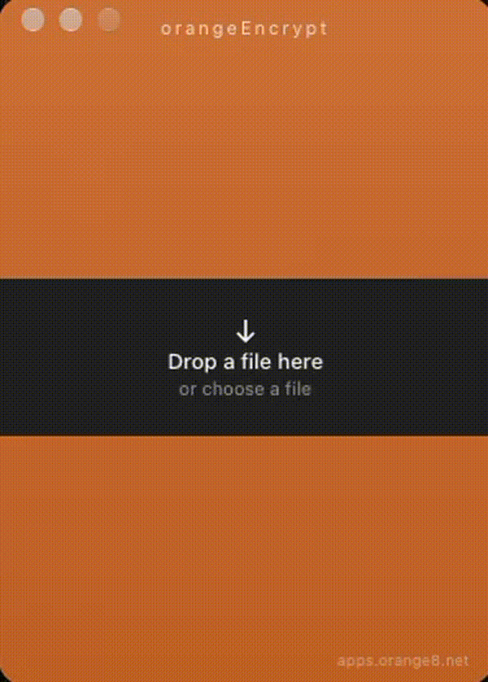

# orangeEncrypt

Simple, cross-platform file encryption powered by OpenPGP.

A small desktop app for encrypting files on your own computer. No account, no server, and no upload as part of encryption. The result is a standard OpenPGP `.gpg` file.

Português: [README-pt_BR.md](README-pt_BR.md)

[](LICENSE)
[](https://github.com/radeschi/orangeEncrypt/releases)
[](https://github.com/radeschi/orangeEncrypt/actions/workflows/build.yml)

Website: [apps.orange8.net](https://apps.orange8.net)



## Need to protect a file before sending or storing it?

A common shortcut is to put the file in a ZIP and set a password. That works as packaging: ZIP is an archive and compression format that can also carry a password.

orangeEncrypt is for a narrower job. When the goal is to protect a file, encryption is the operation itself. You do not create an account, send the file to a service, or wrap it in an archive just to lock it.

## Why orangeEncrypt?

The app stays on your machine. Encryption does not upload the file, and it does not ask for an account or a server.

It is open source. The encrypted file is ordinary OpenPGP, so it can still be opened with [GnuPG](https://gnupg.org/) if this app is gone.

ZIP is great for packaging files. orangeEncrypt is built for a different job: encrypting them.

Password-protected ZIP:

`file → archive → password`

orangeEncrypt:

`file → encryption → encrypted file`

## How it works

1. Choose a file, or drop it on the window.
2. Enter a password and confirm it.
3. Encrypt.
4. Get a `.gpg` file next to the original. The original is not modified.
5. Decrypt later with the same password.

| Input | Result |
| --- | --- |
| One file | `documento.pdf.gpg` |
| One folder | `Documentos.tar.gpg` |
| Several files or folders | `Archive.tar.gpg` |

A single file is encrypted as itself. Several entries are packed into an uncompressed TAR and only then encrypted. Decryption recognizes a TAR from its contents, not from the name alone.

## Features

- Local encryption and decryption of files and folders
- Password protection, with the password confirmed before encryption
- OpenPGP output (`.gpg`), readable by GnuPG
- A small desktop window: drop a file, or pick one
- Progress, an estimate of the remaining time, and cancel
- Cancel removes the partial file. The original is left as it was
- Decrypt, then open the result or save it somewhere else
- The interface follows the system language: Portuguese, English, Spanish, German, French, Japanese, and Chinese. Anything else uses English
- Open source, GPL-3.0
- Signed update check against the GitHub release feed, with a manual check in About
- Installers built for macOS (Apple Silicon and Intel), Windows (x64 and ARM), and Linux (x64 and ARM)

## orangeEncrypt vs. Encrypto

Both are desktop tools for protecting files with a password, on the computer where the file already is. The difference highlighted here is that orangeEncrypt publishes its source.

| | orangeEncrypt | Encrypto |
| --- | --- | --- |
| Desktop application | ✓ | ✓ |
| Local encryption workflow | ✓ | ✓ |
| Password protection | ✓ | ✓ |
| macOS | ✓ | ✓ |
| Windows | ✓ | ✓ |
| Open source | ✓ | — |
| Source code available for inspection | ✓ | — |

orangeEncrypt is intended as an open-source alternative for users who want a simple desktop encryption workflow while being able to inspect the source code.

## Why not just use a password-protected ZIP?

Password-protected ZIP files can be useful, especially when you also need archiving and compression. orangeEncrypt targets a different workflow: when the primary goal is protecting a file, encryption is the primary operation.

A single file stays a single `.gpg` file. It is not compressed, and it is not wrapped in a ZIP.

## Cryptography

[Sequoia PGP](https://sequoia-pgp.org/) writes a binary OpenPGP message:

- AES-256
- session key in an SKESK
- password derived with S2K
- integrity with SEIPD v1 (MDC from RFC 4880)

There is no ASCII armor, no public key, and no AEAD. Writing does not compress. Reading accepts the compression GnuPG uses by default.

The original file is not changed. Output is written to `*.gpg.partial` and renamed only at the end. Cancel deletes that partial file.

The password goes from the window to the local process and is wiped from memory. It is not passed as a process argument, written to a temporary file, or stored in `localStorage`.

The cryptographic backend is Sequoia’s RustCrypto. Sequoia marks that backend as experimental and not constant-time. It is used so the app does not need Nettle or OpenSSL installed on the system.

A wrong password does not reveal the contents. A forgotten password cannot be recovered from the `.gpg`.

Without the app, GnuPG can still open the file.

One file:

```bash
gpg --output documento.pdf --decrypt documento.pdf.gpg
```

A package of several files:

```bash
gpg --output arquivo.tar --decrypt arquivo.tar.gpg
tar -xf arquivo.tar
```

## Privacy

Encryption runs on the computer where you open the app. The encryption workflow does not upload the file to a server and does not require an account.

That is the scope of this claim. The app does not promise anonymity, and a `.gpg` file is only as private as the password and the places you later copy it to.

## Install

Download an installer from the [releases](https://github.com/radeschi/orangeEncrypt/releases).

GitHub Actions builds these targets:

- macOS Apple Silicon and Intel
- Windows x64 and ARM
- Linux x64 and ARM

The macOS builds published from GitHub are not notarized. macOS may ask you to allow the app in Privacy & Security before it opens.

Updates, once you are on a build that includes them, are checked against the latest GitHub release and rejected if the signature does not match.

## Usage

1. Open orangeEncrypt.
2. Drop a file, or choose one.
3. Enter the password and confirm it.
4. Click Encrypt.
5. The `.gpg` file is created locally. The original stays in place.

To decrypt, drop a `.gpg` file, confirm that you want to decrypt it, and enter the password. For a normal file you can open it or save a copy. For several files packed as a TAR, opening reveals the folder and saving asks for a directory.

## Open source

orangeEncrypt is licensed under the GNU General Public License v3.0. See [LICENSE](LICENSE).

## Project status

The version in this source tree is 1.0.5. The project is in active development: the encrypt and decrypt flow is usable, and the interface and release tooling are still being refined.

## Contributing

Issues and pull requests are welcome. Use [issues](https://github.com/radeschi/orangeEncrypt/issues) for bugs and ideas. There is no separate contributing guide yet.

Development needs Node.js, Rust, and the system build tools. GnuPG is used only by the interoperability tests.

```bash
npm install
npm run tauri dev
```

Force a language for one session:

```bash
VITE_LOCALE=en npm run tauri dev
```

Tests and a local production build:

```bash
npm test
cargo test --manifest-path src-tauri/Cargo.toml
npm run tauri build
```

## Links

- [Repository](https://github.com/radeschi/orangeEncrypt)
- [Releases](https://github.com/radeschi/orangeEncrypt/releases)
- [Issues](https://github.com/radeschi/orangeEncrypt/issues)
- [apps.orange8.net](https://apps.orange8.net)
